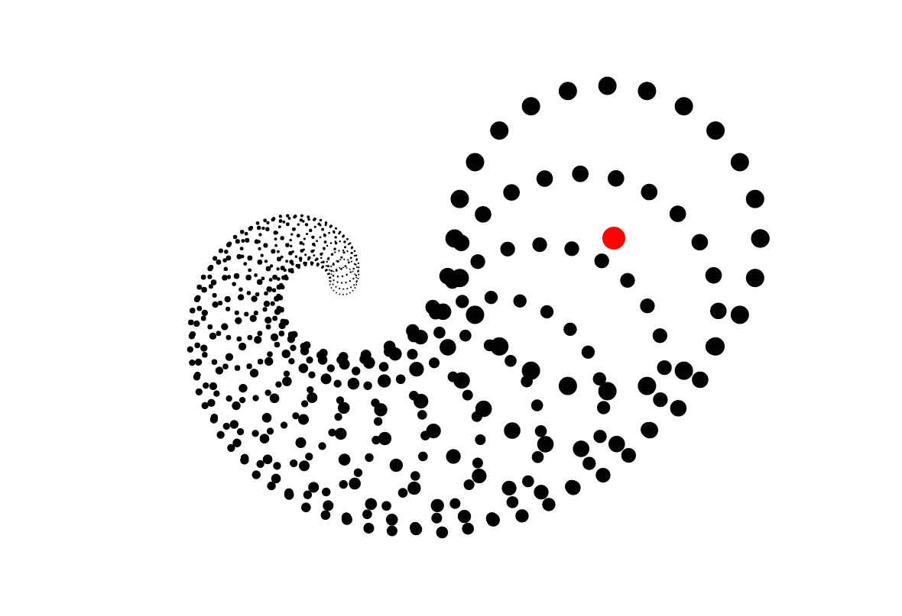

--***Please note this application was made in 2016 and is not a current reflection of my skills***--

## Interactive Spiral

[Github Pages link][github-pages] **NB:** Live Spiral!

[github-pages]: http://gregferg.github.io/interactive_spiral/



The Interactive Spiral creates a circular spiral from the mouse position to the center of the screen.

###Features

#### Spiral Algorithm


Given the mouse position and center of the browser window, the algorithm calculates the next point where a circle of a smaller radius must be drawn to give the illusion of a spiral heading towards the center point. The default appearance of a circular spiral is made by creating multiple spirals in the form of a circle.

The starting radius, ratio of radius reduction between points, number of circles drawn, angles between each circle, and rate of collapse towards the center can all be changed for a different visual effect.

##### Code

```javascript
CurlyDepthLine.prototype.draw = function() {
  var vec = Util.scale(
    [this.start[0],
    this.start[1]],
    1
  );
  var startingPos = vec;
  var startingAngle = this.startingAngle;
  var startingRadius = 12;
  var radius = this.radius;
  var rateOfCollapse = .9;

  for (var i = 0; i < 25; i++) {
    startingAngle = this.nextAngle(startingAngle);
    startingPos = this.nextPoint(radius, startingAngle);
    radius = collapseRateRadius(radius);
    rateOfCollapse = collapseRate(rateOfCollapse);
    startingRadius = collapseRateSizeRadius(startingRadius);

    this.drawNode(startingPos, startingRadius);
  }
};


CurlyDepthLine.prototype.calculateStartingAngle = function(start, end) {
  return Math.atan((start[1] - end[1]) / (start[0] - end[0]));
};

CurlyDepthLine.prototype.nextAngle = function(prevAngle) {
  return prevAngle + Math.PI / 12;
};


CurlyDepthLine.prototype.nextPoint = function(prevRadius, prevAngle) {
  // Since cos and sin can only return positive given some inputs,
  // this checks to see if the point needs to be mirrored to negative or not
  // so that the next circles are not reflected
  var mirror = 1;

  if (this.start[0] - this.end[0] < 0) {
    mirror = -1;
  }

  return [
    this.end[0] + prevRadius * Math.cos(prevAngle) * mirror,
    this.end[1] + prevRadius * Math.sin(prevAngle) * mirror
  ];
};


CurlyDepthLine.prototype.drawNode = function(pos, radius) {
  var ctx = this.ctx;

  ctx.beginPath();
  ctx.moveTo(pos[0], pos[1]);
  ctx.arc(
    pos[0], pos[1], radius, 0, 2 * Math.PI, true
  );
  ctx.fill();

};

```


#### Floating Effect

To make the visual effect more interesting, an addition layer of complexity was added to make the circle slow down exponentially as it approached the mouse's position. This induces an illusion similar to the slow freezing of time.


#### Change Rate of Collapse

The action of clicking toggles the rate of collapse of circles towards the center adding another element of interactivity


###### Future Features

* Add slider bars to change the the rate of collapse, starting circle radius, number of spiral lines, etc
* Add a revert to default button
* Create transitions between states and editing of algorithm.
