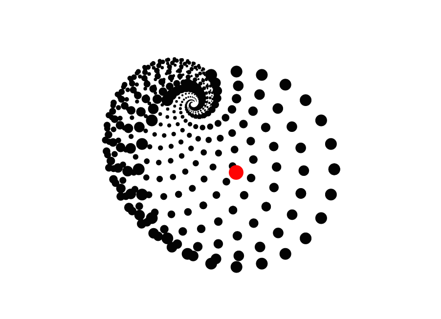
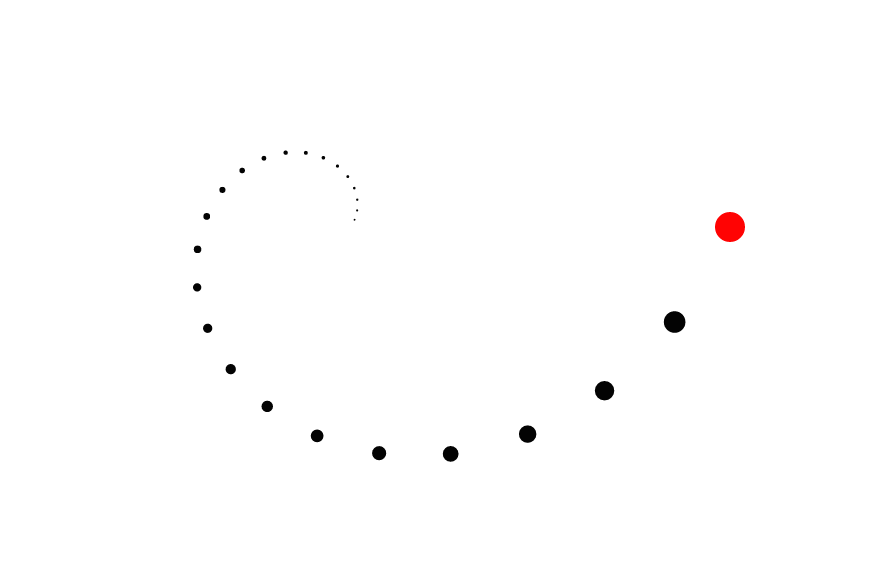

## Interactive Spiral

[Github Pages link][github-pages] **NB:** Live Spiral!

[github-pages]: http://gregferg.github.io/interactive_spiral/

The Interactive Spiral creates a circular spiral from the mouse position to the center of the screen.

--Coming Soon-- Change the algorithm to result in different visuals

###Features

#### Spiral Algorithm

Given the mouse position and center of the browser window, the algorithm calculates the next point where a circle of a smaller radius must be drawn to give the illusion of a spiral heading towards the center point. The default appearance of a circular spiral is made by creating multiple spirals in the form of a circle.

The starting radius, ratio of radius reduction between points, number of circles drawn, angles between each circle, and rate of collapse towards the center can all be changed for a different visual effect.

#### Floating Effect

To make the visual effect more interesting, an addition layer of complexity was added to make the circle slow down exponentially as it approached the mouse's position. This induces an illusion similar to the slow freezing of time.
